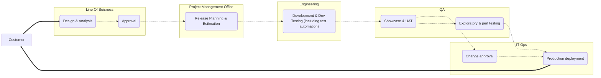

+++
showdate = true
title = "Value Stream Maps (VSM) DevOps Basics - Part 6"
date = 2022-12-23
url = "/blog/devops_basics_6"
+++

# [What is a VSM?]()
A value stream map is a popular tool for DevOps transformation. Basically it is a flowchart like technique which identifies all the relevant application and systems and visualize the end to end delivery process. It provides a visibilty of work for the organization. You can create a value stream map by gathering stakeholders from every part of the product development value stream: the business line, design, testing, QA, operations, and support. You break the value stream into 5 to 15 process blocks. In each block, you record the activity that's performed.

Let's take an example with the following flowchart:
